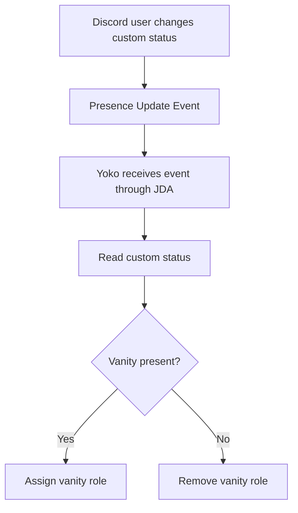
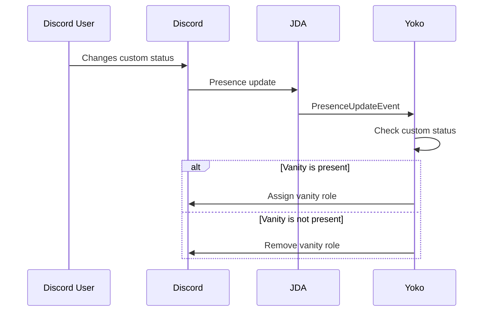
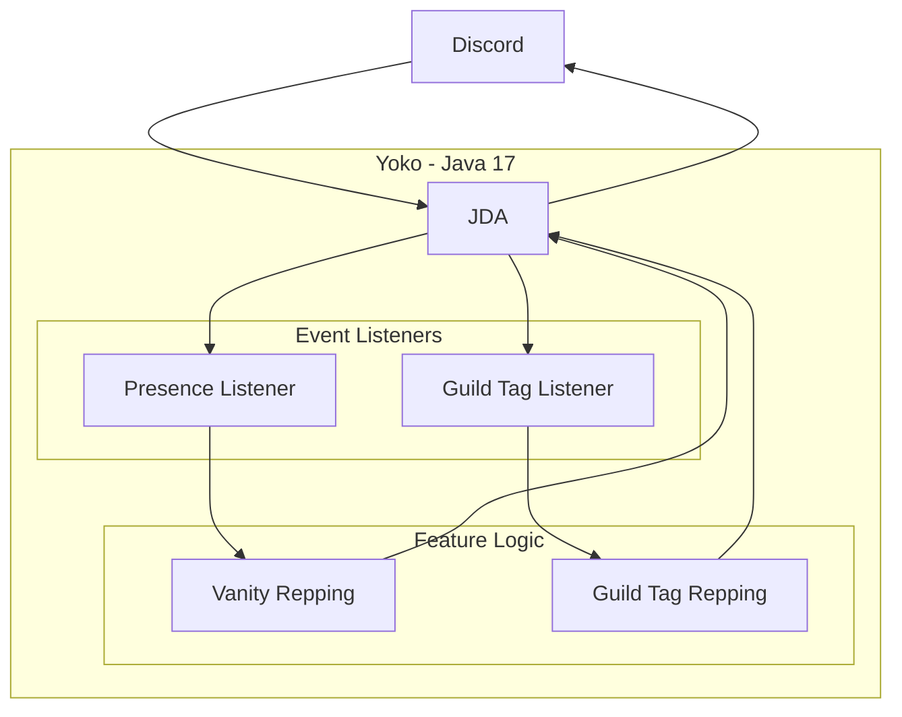

# Yoko Public (WIP)
This is the public repository for the Yoko Discord bot.

## What is Yoko?
Yoko is a Discord bot developed as a personal software engineering project.

The project focuses on automating Discord server management tasks while providing an environment for experimenting with different technologies and software development concepts.

Yoko is currently in active development, with new functionality being added over time.

## Features

### Vanity Repping
Yoko automatically manages vanity roles based on a user's Discord custom status.

When a member adds the configured server vanity to their custom status, Yoko automatically assigns the corresponding role. If the vanity is removed, the role is removed as well.

### Guild Tag Repping
Yoko tracks whether members are displaying the configured server as their primary guild tag.

When a member uses the configured guild tag as their primary tag, Yoko automatically assigns the corresponding role. If the member changes or removes their primary guild tag, the role is removed accordingly.

### Analytics
> Planned — not yet implemented.

### Other
> A ticket system and welcome system are being considered as future Yoko features or as standalone projects.

## How it works

Yoko's current functionality focuses on automatically detecting whether members are representing a configured Discord server and managing the corresponding roles.

### Vanity Repping

Yoko uses Discord presence updates to detect changes to a member's custom status.

When a presence update is received:

1. Yoko retrieves the member's current activities.
2. The custom status is identified and its content is checked.
3. Yoko determines whether the configured vanity is present.
4. The vanity role is added or removed accordingly.

#### Vanity Repping Flow

The flowchart above shows the internal decision process after a presence update is received. The sequence diagram below focuses on the communication between the Discord user, Discord, JDA and Yoko throughout the same process.

#### Sequence Diagram

### Guild Tag Repping

Guild Tag Repping follows a similar process but checks a member's primary guild tag instead of their custom status.

When a relevant member update is received, Yoko checks whether the member's primary guild tag matches the configured server. The corresponding role is then assigned or removed based on the result.

## Architecture

Yoko is built as an event-driven Java application using JDA to communicate with Discord.

Discord events are received through JDA and processed by dedicated event listeners. Business logic is separated from Discord-specific event handling where possible, allowing individual features to remain modular and easier to maintain.

### Architecture Diagram

The following diagram provides a simplified overview of Yoko's current architecture and the flow of communication between Discord, JDA and the bot's internal components.

## Technologies

- **Java 17** - Core application development
- **JDA (Java Discord API)** - Discord API integration and event handling
- **Apache Maven** - Dependency management and build automation
- **Git / GitHub** - Version control and project documentation

Yoko is packaged as an executable JAR for deployment.

## Source Code

Yoko's source code is maintained in a private repository and is not publicly available.

This repository serves as the public documentation of the project and contains information about its features, architecture and technical implementation.

Source code access is only provided for review purposes in connection with job applications or professional inquiries.

## Credits

- **Vanity Role** - The vanity repping feature was inspired by [Vanity Roles](https://vanityroles.xyz/).
- **Mermaid** - Diagrams in this repository were created using [Mermaid](https://mermaid.js.org/).
